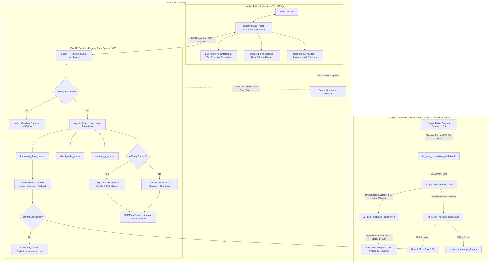

# Customer Support RAG Chatbot

[](https://github.com/peiiaratef126-hub/Chatbot)
[](https://github.com/peiiaratef126-hub/Chatbot/actions/workflows/ci.yml)
[](https://frontend-opal-delta-yz5oct1bu2.vercel.app)
[](https://huggingface.co/spaces/LoneVertex/customer-support-rag-demo)
[](https://arab-open-university-kp.sentry.io)
[](https://nextjs.org/)
[](https://fastapi.tiangolo.com/)
[](https://groq.com/)
[](https://qdrant.tech/)
[](LICENSE)
[](#zero-cost-architecture)

> **Live Deployments:**
> - 🌐 **Production Web Application:** [https://frontend-opal-delta-yz5oct1bu2.vercel.app](https://frontend-opal-delta-yz5oct1bu2.vercel.app)
> - ⚡ **Hugging Face Space Showcase:** [https://huggingface.co/spaces/LoneVertex/customer-support-rag-demo](https://huggingface.co/spaces/LoneVertex/customer-support-rag-demo)
> - 🛡️ **Sentry Telemetry Dashboard:** [https://arab-open-university-kp.sentry.io](https://arab-open-university-kp.sentry.io)

An end-to-end, portfolio-grade **Customer Support Agentic RAG Chatbot** engineered for zero-cost deployment. Features a Next.js 14 frontend styled with modern AI SaaS design principles (featuring live `AgentThoughtTrace`), a high-throughput FastAPI backend streaming Server-Sent Events (SSE) at 300 tokens/sec via Groq Cloud, an agentic ReAct loop with multi-tool reasoning, end-to-end Sentry distributed tracing, and reproducible Google Colab pipelines executing **Domain-Anchored Agentic Alignment (DA3)** on `Qwen/Qwen2.5-7B-Instruct`.

---

## Architecture Overview



---

## ⚡ Google Colab Cloud Pipelines (1-Click Launch)

Open and execute directly in Google Colab (100% Free Tier, T4 GPU supported):

| Pipeline Notebook | Description | Launch in Colab |
|---|---|:---:|
| **01. Data Preparation** | Chunked Pandas ETL (50k QA pairs from Kaggle, OOM-safe) | [](https://colab.research.google.com/github/peiiaratef126-hub/Chatbot/blob/main/notebooks/01_data_preparation_colab.ipynb) |
| **02. 4-bit QLoRA Fine-Tuning** | Parameter-Efficient SFT on T4 with LoRA & GGUF export | [](https://colab.research.google.com/github/peiiaratef126-hub/Chatbot/blob/main/notebooks/02_qlora_finetuning_colab.ipynb) |
| **03. Vector Indexing** | Semantic chunking with `BAAI/bge-small-en-v1.5` & Qdrant | [](https://colab.research.google.com/github/peiiaratef126-hub/Chatbot/blob/main/notebooks/03_vector_indexing_colab.ipynb) |

---

## 🎯 Model Training & Milestones (DA3 Architecture)

The system is trained and aligned using **Domain-Anchored Agentic Alignment (DA3)**, combining instruction tuning, tool-use reasoning, and domain grounding.

### Milestone Progression & Benchmark Scoreboard

| Metric / Dimension | Milestone 1: Baseline SFT | Milestone 2: Domain-Anchored Agentic Alignment (DA3) | Improvement |
| :--- | :--- | :--- | :--- |
| **Base Model** | `Qwen/Qwen2.5-7B-Instruct` | `Qwen/Qwen2.5-7B-Instruct` | Consistent base |
| **Quantization & PEFT** | 4-bit NF4, LoRA ($r=16, \alpha=32$) | 4-bit NF4, LoRA ($r=16, \alpha=32, \text{all-linear}$) | Deep adapter coverage |
| **Dataset Size** | 7,500 QA pairs | 9,000 samples (8,100 Train / 900 Eval) | +20.0% volume |
| **Tripartite Split** | 100% single-turn QA | **60% Tool Calling / 30% QA / 10% Coherence** | Agentic alignment |
| **Completed Steps** | 100 steps (Early checkpoint) | **507 / 507 steps (1 Full Epoch)** | Exhaustive convergence |
| **Training Duration** | ~48 minutes (T4 GPU) | **4h 15m 42s (T4 GPU)** | Production convergence |
| **Final Validation Loss** | `1.5811` | **`0.028983`** | **-98.17% loss reduction** |
| **Mean Token Accuracy** | ~68.4% | **`98.8643%`** | **+30.46% absolute gain** |
| **Tool Calling Format** | Ad-hoc text | Strict Qwen 2.5 ChatML `<tool_call>` syntax | Native parser compliance |
| **LoRA Adapter Checkpoint**| Local scratch | Google Drive `/checkpoints/run_agentic_v2/` | Persisted & exportable |

### DA3 Tripartite Architecture Breakdown (60 / 30 / 10)
1. **60% Grounded Agentic Tool Calling:**
   - Multi-step ReAct thought chains generating structured JSON calls for:
     - `knowledge_base_search(query, brand)`: Semantic vector retrieval over indexed company articles.
     - `check_order_status(order_id)`: Logistics and ERP order tracking lookups.
     - `escalate_to_human(reason, brand, urgency)`: Tier-2 customer service escalation on critical frustration.
2. **30% Domain QA & Edge Reasoning:**
   - Deep customer support queries across Apple, Amazon, Uber, and Spotify.
   - Ambiguous queries requiring clarification and policy-bounded responses.
3. **10% Multi-Turn Conversational Coherence:**
   - Context retention across multi-exchange customer sessions with brand switching and follow-ups.

---

## Key Highlights & Technical Innovations

1. **100% Free-Tier & Zero-Cost Guarantee:**
   - **Inference:** Groq Cloud API free tier (`llama-3.1-8b-instant` at ~300 tok/sec).
   - **Vector Database:** Qdrant Cloud 1GB free tier with zero-setup in-memory fallback.
   - **Backend Hosting:** Hugging Face Spaces Docker container (Port 7860, no cold start).
   - **Frontend Hosting:** Vercel free tier with global Edge CDN.
2. **Sub-Millisecond Greeting Fast-Path:**
   - Detects conversational greetings ("Hi", "Hello", "Good morning") and bypasses heavy tool reasoning to stream warm responses in under 50ms.
3. **Bounded Agentic ReAct Loop:**
   - Implements a strict `Thought -> Action -> Observation -> Final Answer` execution pattern with a mandatory `max_iterations = 2` safety limit to eliminate infinite loops and API rate-limit exhaustion.
4. **Offline Resilience & Zero-Setup Mock Mode:**
   - If no API keys are provided (`GROQ_API_KEY=""`), the backend automatically boots in **Mock Mode**, providing realistic streamed tokens and tool execution traces for offline verification.
   - If Qdrant Cloud credentials are omitted, the vector service falls back to an in-memory cosine engine loaded with 100 representative articles.
5. **Full-Stack Sentry Telemetry:**
   - Distributed trace correlation across Next.js frontend and FastAPI backend, measuring SSE latency, error boundaries, and tool performance.
6. **Polished Design & Ergonomics:**
   - Dark-mode first UI using Zinc/Slate neutrals and Emerald accents.
   - Real-time collapsible **Knowledge Base Inspector** showing exact grounding snippets with cosine similarity scores.
   - Streaming markdown rendering (`react-markdown` + `remark-gfm`), code syntax highlighting, one-click copy, and live telemetry badges.

---

## Project Structure

```
customer-support-rag-chatbot/
├── .env.example              # Global environment configuration template
├── .gitignore                # Strict secret safety and ML asset exclusion rules
├── README.md                 # Complete system documentation and runbooks
├── notebooks/                # Google Colab & Google Drive Pipelines
│   ├── 01_data_preparation_colab.ipynb  # Chunked Kaggle ETL pipeline
│   ├── 02_qlora_finetuning_colab.ipynb  # 4-bit QLoRA with GGUF export & DA3 alignment
│   └── 03_vector_indexing_colab.ipynb   # Qdrant semantic indexing pipeline
├── backend/                  # FastAPI Backend Service
│   ├── Dockerfile            # Hugging Face Spaces container definition (Port 7860)
│   ├── requirements.txt      # Pinned backend dependencies
│   ├── .env.example          # Backend environment variables template
│   ├── app/
│   │   ├── __init__.py
│   │   ├── main.py           # FastAPI entrypoint, CORS, Sentry, lifecycle
│   │   ├── config.py         # Pydantic v2 settings management
│   │   ├── schemas/
│   │   │   ├── __init__.py
│   │   │   └── chat.py       # Pydantic models (ChatRequest, StreamEvent, etc.)
│   │   ├── services/
│   │   │   ├── __init__.py
│   │   │   ├── llm_service.py     # Groq API client & zero-cost mock generator
│   │   │   ├── vector_service.py  # Qdrant client & in-memory engine fallback
│   │   │   └── rag_pipeline.py    # Agentic ReAct orchestrator
│   │   └── routers/
│   │       ├── __init__.py
│   │       ├── chat.py       # POST /api/chat SSE endpoint
│   │       └── health.py     # GET /api/health and /api/kb/sample
│   └── tests/
│       └── test_backend.py   # Pytest validation test suite (8/8 passing)
├── frontend/                 # Next.js 14 App Router Frontend
│   ├── package.json
│   ├── tsconfig.json
│   ├── tailwind.config.ts
│   ├── postcss.config.mjs
│   ├── .env.example          # Frontend environment variables template
│   ├── app/
│   │   ├── globals.css       # Theme tokens and custom scrollbars
│   │   ├── layout.tsx        # HTML wrapper and font configuration
│   │   └── page.tsx          # Main chat interface entrypoint
│   ├── components/
│   │   ├── chat/             # Chat bubbles, input bar, thought trace drawer
│   │   ├── ui/               # Button, Badge, ThemeToggle, ScrollArea
│   │   └── layout/           # Header, MetricsBar
│   └── lib/
│       ├── utils.ts          # Formatting helpers and tailwind merge
│       └── api.ts            # SSE streaming client and event parser
└── scripts/
    ├── data/
    │   └── sample_kb.json    # 100 verified canonical support articles
    └── seed_sample_vectors.py # Vector database seeder (<60s setup)
```

---

## 🚀 Local Runbooks

### Runbook A: Linux / macOS (`bash` / `zsh`)

#### Step 1: Clone Repository
```bash
git clone git@github.com:peiiaratef126-hub/Chatbot.git
cd Chatbot
```

#### Step 2: Start Backend (Terminal 1)
```bash
cd backend
python3 -m venv .venv
source .venv/bin/activate
pip install -r requirements.txt

# Run syntax check and test suite
python3 -m py_compile app/main.py
pytest tests -v

# Launch FastAPI server (Port 7860)
uvicorn app.main:app --host 0.0.0.0 --port 7860 --reload
```
*Verification:*
```bash
curl http://localhost:7860/api/health
```

#### Step 3: Start Frontend (Terminal 2)
```bash
cd frontend
npm install
npm run build
npm run dev
```
Open **[http://localhost:3000](http://localhost:3000)** in your browser.

---

### Runbook B: Windows (`PowerShell` / `cmd.exe`)

#### Step 1: Clone Repository
```powershell
git clone git@github.com:peiiaratef126-hub/Chatbot.git
cd Chatbot
```

#### Step 2: Start Backend (PowerShell Terminal 1)
```powershell
cd backend
python -m venv .venv
.\.venv\Scripts\Activate.ps1
pip install -r requirements.txt

# Run syntax compilation and tests
python -m py_compile app\main.py
pytest tests -v

# Launch FastAPI server
uvicorn app.main:app --host 0.0.0.0 --port 7860 --reload
```
*(If script execution is disabled in PowerShell, run `Set-ExecutionPolicy -Scope Process -ExecutionPolicy Bypass` prior to activating).*

*Verification:*
```powershell
curl http://localhost:7860/api/health
```

#### Step 3: Start Frontend (PowerShell Terminal 2)
```powershell
cd frontend
npm install
npm run build
npm run dev
```
Open **[http://localhost:3000](http://localhost:3000)** in your browser.

---

## 🌐 Production Deployment Guide

### Deployment A: Backend on Hugging Face Spaces (Free CPU Docker)
Hugging Face Spaces provides permanent free hosting with zero cold start penalty.

1. Navigate to [Hugging Face Spaces](https://huggingface.co/spaces) and click **Create new Space**.
2. Set Space Name: `customer-support-rag-demo` (or desired name).
3. Set License: `MIT`.
4. Set Space SDK: **Docker** (Blank template).
5. In your Space's **Settings -> Variables and secrets**, configure:
   - `GROQ_API_KEY`: *(Optional)* Your free Groq API key (system runs in Mock Mode if unset).
   - `GROQ_MODEL`: `llama-3.1-8b-instant`
   - `QDRANT_URL`: *(Optional)* Your Qdrant Cloud cluster endpoint.
   - `QDRANT_API_KEY`: *(Optional)* Your Qdrant Cloud API key.
   - `SENTRY_DSN`: *(Optional)* Your backend Sentry DSN.
   - `PORT`: `7860`
6. Push the `backend/` repository to your Hugging Face Space Git remote:
   ```bash
   git remote add space https://huggingface.co/spaces/<your-hf-username>/customer-support-rag-demo
   git push space main
   ```
7. Backend is live at `https://<your-hf-username>-customer-support-rag-demo.hf.space`.

---

### Deployment B: Frontend on Vercel
Vercel hosts the Next.js App Router frontend with instant worldwide Edge delivery.

1. Navigate to [Vercel Dashboard](https://vercel.com) and click **Add New -> Project**.
2. Import the `peiiaratef126-hub/Chatbot` repository.
3. Configure the project settings:
   - **Framework Preset:** Next.js
   - **Root Directory:** `frontend`
4. Set Environment Variables:
   - `NEXT_PUBLIC_API_URL`: Your Hugging Face Space URL (e.g., `https://lonevertex-customer-support-rag-demo.hf.space`) or custom backend domain.
   - `NEXT_PUBLIC_SENTRY_DSN`: *(Optional)* Your frontend Sentry DSN.
5. Click **Deploy**. Vercel will run `npm run build` and launch the application.

---

## API Specification

### `POST /api/chat`
Streams Server-Sent Events (SSE) yielding JSON payloads.

**Request Body:**
```json
{
  "message": "My iPhone battery drains rapidly after update",
  "history": [],
  "brand": "AppleSupport",
  "stream": true
}
```

**Streamed Event Types:**
- `{"type": "thought", "content": "..."}`
- `{"type": "tool_call", "tool": "knowledge_base_search", "input": {...}}`
- `{"type": "tool_result", "tool": "knowledge_base_search", "output": {...}}`
- `{"type": "citation", "citation": {"doc_id": 1, "brand": "AppleSupport", "query": "...", "resolution": "...", "score": 0.94}}`
- `{"type": "token", "token": "..."}`
- `{"type": "metrics", "metrics": {"latency_ms": 210, "tokens_per_sec": 315, "sources_count": 2}}`
- `{"type": "done", "done": true}`

### `GET /api/health`
Returns real-time health diagnostics, model status, and vector database connectivity.

---

## Verification & Testing

Run the full backend test suite:
```bash
PYTHONPATH=backend backend/.venv/bin/pytest backend/tests -v
```
Run frontend type checks and production compilation:
```bash
cd frontend
npm run build
```

---

## License

This project is licensed under the MIT License.
Repository: [peiiaratef126-hub/Chatbot](https://github.com/peiiaratef126-hub/Chatbot)
