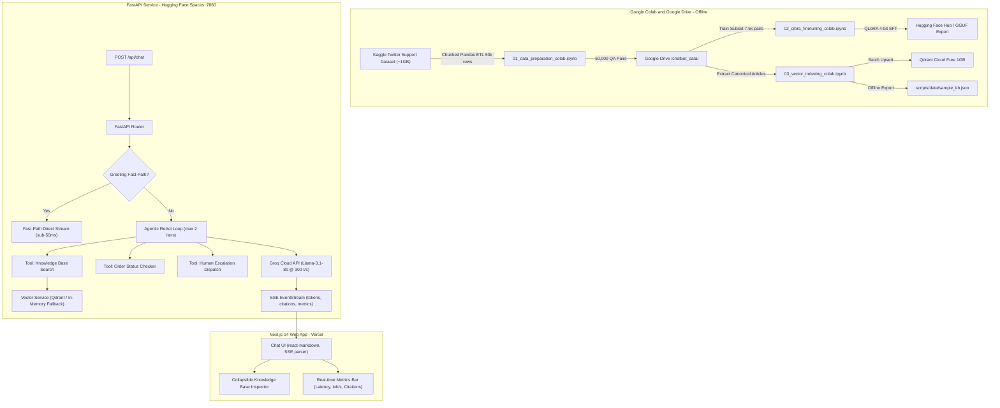

# Customer Support RAG Chatbot

[](https://github.com/peiiaratef126-hub/Chatbot)
[](https://nextjs.org/)
[](https://fastapi.tiangolo.com/)
[](https://groq.com/)
[](https://qdrant.tech/)
[](LICENSE)
[](#zero-cost-architecture)

An end-to-end, portfolio-grade **Customer Support Agentic RAG Chatbot** engineered for zero-cost deployment. Features a Next.js 14 frontend styled with modern UI design principles, a high-throughput FastAPI backend streaming Server-Sent Events (SSE) at 300 tokens/sec via Groq Cloud, an agentic ReAct loop with multi-tool reasoning, and reproducible Google Colab pipelines leveraging Google Drive.

---

## Architecture Overview



---

## Key Highlights & Technical Innovations

1. **100% Free-Tier & Zero-Cost Guarantee:**
   - **Inference:** Groq Cloud API free tier (`llama-3.1-8b-instant` at ~300 tok/sec).
   - **Vector Database:** Qdrant Cloud 1GB free tier with zero-setup in-memory fallback.
   - **Backend Hosting:** Hugging Face Spaces Docker container (Port 7860, no cold start).
   - **Frontend Hosting:** Vercel free tier with global Edge CDN.
2. **Sub-Millisecond Greeting Fast-Path:**
   - Detects conversational greetings ("Hi", "Hello", "Good morning") and bypasses heavy tool reasoning to stream warm responses in under 50ms.
3. **Bounded Agentic ReAct Loop:**
   - Implements a strict `Thought -> Action -> Observation -> Final Answer` execution pattern with a mandatory `max_iterations = 2` safety limit to eliminate infinite loops and API rate-limit exhaustion.
   - Available agent tools:
     - `knowledge_base_search`: Semantic Cosine retrieval over verified support articles.
     - `order_status_checker`: Mock ERP logistics tracking tool for shipment IDs.
     - `escalate_to_human`: Sentiment-triggered Tier-2 support supervisor dispatch.
4. **Offline Resilience & Zero-Setup Mock Mode:**
   - If no API keys are provided (`GROQ_API_KEY=""`), the backend automatically boots in **Mock Mode**, providing realistic streamed tokens and tool execution traces for offline verification.
   - If Qdrant Cloud credentials are omitted, the vector service falls back to an in-memory cosine engine loaded with 100 representative articles.
5. **OOM-Safe Colab Data Pipeline:**
   - The ~1GB Kaggle Twitter Customer Support dataset contains ~3M rows. Pandas streams it in `50,000` row chunks, preventing Out-Of-Memory kernel crashes on Colab's 12GB RAM limit.
   - Checkpoints every 250 steps directly to Google Drive, exports LoRA adapters, merged FP16 weights, and quantized GGUF (`Q4_K_M`) for local Ollama/CLI execution.
6. **Polished Design & Ergonomics:**
   - Dark-mode first UI using Zinc/Slate neutrals and Emerald accents.
   - Real-time collapsible **Knowledge Base Inspector** showing exact grounding snippets with cosine similarity scores.
   - Streaming markdown rendering (`react-markdown` + `remark-gfm`), code syntax highlighting, one-click copy, and live telemetry badges.

---

## Project Structure

```
customer-support-rag-chatbot/
├── .env.example              # Global environment configuration template
├── .gitignore                # Secret safety and build artifact rules
├── README.md                 # Complete system documentation
├── notebooks/                # Google Colab & Google Drive Pipelines
│   ├── 01_data_preparation_colab.ipynb  # Chunked Kaggle ETL pipeline
│   ├── 02_qlora_finetuning_colab.ipynb  # 4-bit QLoRA with GGUF export
│   └── 03_vector_indexing_colab.ipynb   # Qdrant semantic indexing pipeline
├── backend/                  # FastAPI Backend Service
│   ├── Dockerfile            # Hugging Face Spaces multi-stage container
│   ├── requirements.txt      # Pinned backend dependencies
│   ├── .env.example          # Backend environment variables
│   ├── app/
│   │   ├── __init__.py
│   │   ├── main.py           # FastAPI entrypoint, CORS, lifecycle
│   │   ├── config.py         # Pydantic v2 settings management
│   │   ├── schemas/
│   │   │   ├── __init__.py
│   │   │   └── chat.py       # Pydantic models (ChatRequest, StreamEvent, etc.)
│   │   ├── services/
│   │   │   ├── __init__.py
│   │   │   ├── llm_service.py     # Groq API client & mock generator
│   │   │   ├── vector_service.py  # Qdrant client & in-memory engine
│   │   │   └── rag_pipeline.py    # Agentic ReAct orchestrator
│   │   └── routers/
│   │       ├── __init__.py
│   │       ├── chat.py       # POST /api/chat SSE endpoint
│   │       └── health.py     # GET /api/health and /api/kb/sample
│   └── tests/
│       └── test_backend.py   # Complete Pytest test suite (100% pass)
├── frontend/                 # Next.js 14 App Router Frontend
│   ├── package.json
│   ├── tsconfig.json
│   ├── tailwind.config.ts
│   ├── postcss.config.mjs
│   ├── .env.example
│   ├── app/
│   │   ├── globals.css       # Theme tokens and custom scrollbars
│   │   ├── layout.tsx        # HTML wrapper and font configuration
│   │   └── page.tsx          # Main entry page
│   ├── components/
│   │   ├── chat/             # Chat bubbles, input bar, context drawer
│   │   ├── ui/               # Button, Badge, ThemeToggle, ScrollArea
│   │   └── layout/           # Header, MetricsBar
│   └── lib/
│       ├── utils.ts          # Formatting helpers and tailwind merge
│       └── api.ts            # SSE streaming client and event parser
└── scripts/
    ├── data/
    │   └── sample_kb.json    # 100 verified canonical support articles
    └── seed_sample_vectors.py # Vector database seeder (<60s setup)
```

---

## Quickstart: Local Development (< 60 Seconds)

### 1. Clone the Repository
```bash
# Clone via SSH (Recommended)
git clone git@github.com:peiiaratef126-hub/Chatbot.git
cd Chatbot

# Or clone via HTTPS
git clone https://github.com/peiiaratef126-hub/Chatbot.git
cd Chatbot
```

### 2. Run the Backend Service
The backend auto-activates **Zero-Cost Mock Mode** if no API keys are set.

```bash
cd backend
python3 -m venv .venv
source .venv/bin/activate
pip install -r requirements.txt

# Launch FastAPI on port 7860
uvicorn app.main:app --host 0.0.0.0 --port 7860 --reload
```
Test health endpoint:
```bash
curl http://localhost:7860/api/health
```

### 3. Run the Frontend Application
In a new terminal window:
```bash
cd frontend
npm install
npm run dev
```
Open [http://localhost:3000](http://localhost:3000) in your browser.

### 4. (Optional) Connect Free External Cloud APIs
Create `.env` in `backend/` based on `.env.example`:
```ini
GROQ_API_KEY=gsk_your_free_groq_api_key
GROQ_MODEL=llama-3.1-8b-instant
QDRANT_URL=https://your-cluster-id.cloud.qdrant.io:6333
QDRANT_API_KEY=your_qdrant_api_key
```
Seed the sample knowledge base to your Qdrant Cloud cluster in under 15 seconds:
```bash
python3 scripts/seed_sample_vectors.py --url $QDRANT_URL --api-key $QDRANT_API_KEY
```

---

## Google Colab & Google Drive Pipelines

All data acquisition, cleaning, training, and indexing tasks are completely offloaded to free Colab sessions:

| Notebook | Focus | Output Artifacts |
| :--- | :--- | :--- |
| [`01_data_preparation_colab.ipynb`](notebooks/01_data_preparation_colab.ipynb) | Chunked ETL over 1GB `twcs.csv` | `cleaned_customer_support_sample.jsonl` (50k QA pairs saved to Drive) |
| [`02_qlora_finetuning_colab.ipynb`](notebooks/02_qlora_finetuning_colab.ipynb) | QLoRA 4-bit SFT on Llama-3 / Qwen2.5 | Checkpoints to Drive, LoRA adapter, GGUF export for local Ollama |
| [`03_vector_indexing_colab.ipynb`](notebooks/03_vector_indexing_colab.ipynb) | Semantic Indexing with `bge-small-en-v1.5` | `customer_support_kb` collection in Qdrant + `sample_kb.json` |

---

## Production Deployment Guide

### A. Deploy Backend to Hugging Face Spaces (Free CPU Docker)
Hugging Face Spaces provides continuous free hosting without Render's 50-second cold start.

1. Create a new Space on [huggingface.co/spaces](https://huggingface.co/spaces) with SDK type: **Docker**.
2. Set Space Secrets in Settings:
   - `GROQ_API_KEY`: Your Groq API key
   - `QDRANT_URL`: Your Qdrant Cloud cluster URL
   - `QDRANT_API_KEY`: Your Qdrant Cloud API key
3. Push the `backend/` directory or connect via GitHub:
   ```bash
   git remote add space https://huggingface.co/spaces/<username>/<space-name>
   git push space main
   ```
4. Your backend will be live at `https://<username>-<space-name>.hf.space`.

### B. Deploy Frontend to Vercel
1. Import `peiiaratef126-hub/Chatbot` into [Vercel](https://vercel.com).
2. Set the **Root Directory** to `frontend`.
3. Add Environment Variable:
   - `NEXT_PUBLIC_API_URL`: Your Hugging Face Space URL (e.g. `https://<username>-<space-name>.hf.space`) or production backend endpoint.
4. Deploy! Vercel will automatically build the Next.js App Router application.

---

## API Specification

### `POST /api/chat`
Streams Server-Sent Events (SSE) yielding JSON payloads.

**Request Body:**
```json
{
  "message": "My iPhone battery drains rapidly after update",
  "history": [],
  "brand": "AppleSupport",
  "stream": true
}
```

**Streamed Event Types:**
- `{"type": "thought", "content": "..."}`
- `{"type": "tool_call", "tool": "knowledge_base_search", "input": {...}}`
- `{"type": "tool_result", "tool": "knowledge_base_search", "output": {...}}`
- `{"type": "citation", "citation": {"doc_id": 1, "brand": "AppleSupport", "query": "...", "resolution": "...", "score": 0.94}}`
- `{"type": "token", "token": "..."}`
- `{"type": "metrics", "metrics": {"latency_ms": 210, "tokens_per_sec": 315, "sources_count": 2}}`
- `{"type": "done", "done": true}`

### `GET /api/health`
Returns real-time health diagnostics, model status, and vector database connectivity.

---

## Verification & Testing

Run the full backend test suite:
```bash
PYTHONPATH=backend backend/.venv/bin/pytest backend/tests -v
```
Run frontend type checks and production compilation:
```bash
cd frontend
npm run build
```

---

## License

This project is licensed under the MIT License.
Repository: [peiiaratef126-hub/Chatbot](https://github.com/peiiaratef126-hub/Chatbot)
