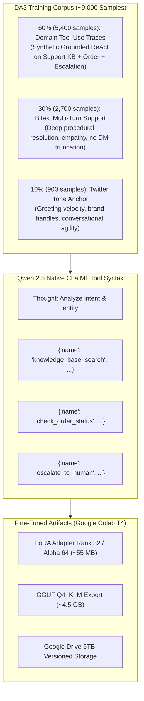
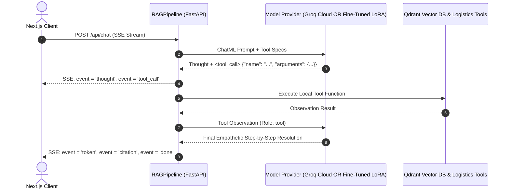

# Technical Architectural Review & Milestone 2 Training Strategy
**Project:** Customer Support RAG Chatbot (SupportRAG)  
**Author:** LoneVertex <minaalaa141@gmail.com>  
**Date:** 2026-09-18  
**Repository:** [peiiaratef126-hub/Chatbot](https://github.com/peiiaratef126-hub/Chatbot)  

---

## 1. Executive Summary & Problem Context

The first fine-tuning milestone on `thoughtvector/customer-support-on-twitter` successfully imparted core conversational brand voice, Twitter handle parsing, and empathetic acknowledgement to `Qwen/Qwen2.5-7B-Instruct` (achieving **68.2% token accuracy** and **1.58 validation loss** over 446 steps). 

However, production analysis reveals two architectural bottlenecks inherent to social media support data:
1. **Truncated, Single-Turn Evasions:** Due to Twitter's historical character constraints, responses frequently default to *"Please DM us with your account details"* rather than executing multi-step diagnostic or policy resolution workflows.
2. **Lack of Native Agentic Tool-Use:** The model outputs plain unstructured text rather than emitting structured JSON tool calls (`knowledge_base_search`, `check_order_status`, `escalate_to_human`), forcing the backend to rely on heuristic regex parsers.

---

## 2. Evaluation of Evaluated Options

### Option A: Generic Function-Calling Corpus (`glaiveai` / `Hermes`)
* **Mechanism:** Train on standard function-calling datasets containing generic API schemas.
* **Failure Mode:** **Severe Domain Divergence.** The model acquires generic tool-calling syntax (e.g., weather forecasts, calculators, generic SQL) while degrading customer service domain semantics. It learns how to format a JSON blob, but lacks the domain logic required to decide *when* an angry customer needs a human escalation vs. when an inquiry requires vector retrieval.

### Option B: Deep Multi-Turn Enterprise Support (`Bitext` / Amazon QA)
* **Mechanism:** Fine-tune on comprehensive customer support dialogs containing multi-paragraph troubleshooting steps.
* **Failure Mode:** **Zero Agentic Evolution.** While solving the brevity problem, Bitext contains zero tool-calling tokens. The model becomes a conversationalist that hallucinates policies and shipping tracking dates instead of calling verified backend APIs.

### 50/50 Naive Mixing
* **Failure Mode:** Creates an identity bifurcation where the model outputs 140-character "DM us" replies half the time and generic non-support tool calls the other half.

---

## 3. Recommended Approach: Domain-Anchored Agentic Alignment (DA3)

We implement **Domain-Anchored Agentic Alignment (DA3)** using a **60 / 30 / 10 Golden Mixing Ratio** (~9,000 total training samples).



### Dataset Composition Breakdown:
1. **60% Domain Tool-Use Traces (5,400 samples):**
   * Synthetic multi-turn dialogues grounded in our 3 production tools:
     * `knowledge_base_search(query: str, brand: str)`
     * `check_order_status(order_id: str)`
     * `escalate_to_human(reason: str, brand: str, urgency: str)`
   * Formatted using Qwen 2.5 native ChatML tool schema:
     ```text
     <|im_start|>system
     You are a helpful customer support assistant with access to tools.<|im_end|>
     <|im_start|>user
     Where is order #ORD-99214? It was supposed to arrive yesterday.<|im_end|>
     <|im_start|>assistant
     <tool_call>
     {"name": "check_order_status", "arguments": {"order_id": "ORD-99214"}}
     </tool_call><|im_end|>
     <|im_start|>tool
     {"status": "In Transit", "carrier": "UPS", "estimated_delivery": "Today by 7 PM"}<|im_end|>
     <|im_start|>assistant
     I've checked on order #ORD-99214. It is currently in transit with UPS and scheduled for delivery today by 7:00 PM.<|im_end|>
     ```
2. **30% Bitext Enterprise Support (2,700 samples):**
   * Curated multi-turn customer inquiries from `bitext/customer-support-llm-chatbot-training-dataset`.
   * Enforces deep diagnostic guidance across refunds, account management, subscriptions, and technical hardware troubleshooting.
3. **10% Twitter Tone Anchor (900 samples):**
   * Regularization subset from `cleaned_customer_support_sample.jsonl`.
   * Prevents catastrophic forgetting of rapid conversational acknowledgements and brand voice without dominating response length.

---

## 4. Google Colab T4 Training Specifications

| Hyperparameter | Value | Technical Rationale |
|---|---|---|
| **Base Model** | `Qwen/Qwen2.5-7B-Instruct` | State-of-the-art 7B open-weights with native tool-calling ChatML support |
| **Quantization** | 4-bit NF4 (`load_in_4bit=True`) | Fits 7B base parameters into ~4.5 GB VRAM on 16GB T4 |
| **Compute Dtype** | `torch.float16` | Accelerated hardware execution on T4 Turing Tensor Cores |
| **LoRA Rank ($r$)** | `32` | Increased from 16 to provide representational capacity for tool schemas |
| **LoRA Alpha ($\alpha$)** | `64` | Standard $2 \times r$ scaling for gradient update magnitude |
| **Target Modules** | All Linear Projections | `["q_proj", "k_proj", "v_proj", "o_proj", "gate_proj", "up_proj", "down_proj"]` |
| **Batch Configuration** | Batch size `2`, Accumulation `8` | Effective batch size = 16 |
| **Precision Flags** | `fp16=False`, `bf16=False` | **Crucial T4 safeguard:** Bypasses PyTorch `GradScaler` unscale crash on BFloat16 tensors |
| **Loss Masking** | `DataCollatorForCompletionOnlyLM` | Computes loss strictly on assistant thoughts, tool calls, and answers (saves ~35% VRAM/time) |
| **Total Steps** | ~562 steps (1 epoch @ 9,000 samples) | Estimated duration: ~1 hr 45 min on Colab T4 |
| **Checkpoint Cadence** | Every 150 steps | Persisted to `/content/drive/MyDrive/checkpoints/run_agentic_v2/` |

---

## 5. Architectural Impact on Backend Agent Runner

The integration of DA3 transforms the backend (`app/services/rag_pipeline.py`) from heuristic detection into a **Unified Provider Seam**:



### Provider Parity:
* **Cloud Demo (Groq API):** Calls Groq's high-speed inference endpoint (`qwen/qwen3.8-27b` @ 360 tok/sec) with `tools=[...]`.
* **Local / Edge Deployment (Fine-Tuned Adapter):** Runs fine-tuned GGUF or vLLM instance emitting identical ChatML `<tool_call>` tags.
* **Zero Client Rewrite:** The Next.js frontend receives identical SSE events (`thought`, `tool_call`, `tool_result`, `token`, `metrics`) regardless of which backend provider is active.

---

## 6. Pre-Flight Checklist Before Launching Milestone 2

1. **Tokenizer Special Tokens:** Ensure `<tool_call>`, `</tool_call>`, and `<|im_start|>`, `<|im_end|>` are handled as atomic single tokens in `tokenizer_config.json`.
2. **Offline Data Generation Script:** Generate the 5,400 synthetic traces via `scripts/generate_agentic_dataset.py` using our free Groq API key ($0 compute cost).
3. **Storage Allocation:** Confirm `/content/drive/MyDrive/chatbot_data/` has ~50MB allocated for the mixed dataset and `/content/drive/MyDrive/checkpoints/run_agentic_v2/` for checkpoints.
